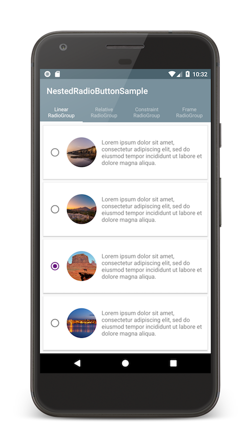

[](https://s01.oss.sonatype.org/service/local/repositories/releases/content/com/github/jbvincey/nestedradiobutton/1.1/)
[](http://www.apache.org/licenses/LICENSE-2.0)

NestedRadioButton
=======

NestedRadioButton lets you have any number of ViewGroup intermediates between your RadioButton and RadioGroup. This allows to embed your RadioButton in more complex selectable views (examples in sample). 



## Install

NestedRadioButton is available on **Maven Central**. To use in your project, simply add the following dependency to your app:
```gradle
dependencies {
    ...
    implementation 'com.github.jbvincey:nestedradiobutton:1.1'
    ...
}
```

#### Warning

NestedRadioButton used to be available on **JCenter** under the package name `com.jbvincey:nestedradiobutton`. Due to **JCenter** shutdown, the NestedRadioButton library has been migrated to **Maven Central** with a different package name `com.github.jbvincey:nestedradiobutton`. If you were pulling the NestedRadioButton library from **JCenter**, make sure to add **Maven Central** repository in your configuration and to update the package name of NestedRadioButton library.

## Usage

```xml
<com.jbvincey.nestedradiobutton.NestedLinearRadioGroup
    android:layout_width="match_parent"
    android:layout_height="match_parent"
    app:checkedButton="@+id/radioButton1">

    <LinearLayout
        android:id="@+id/l1"
        android:layout_width="match_parent"
        android:layout_height="wrap_content">

        <com.jbvincey.nestedradiobutton.NestedRadioButton
            android:id="@+id/radioButton1"
            android:layout_width="wrap_content"
            android:layout_height="wrap_content"
            app:clickableParent="@+id/l1" />
...

```

In your layout, use one of the 4 nested ViewGroup implementation among :
 * `NestedLinearRadioGroup`
 * `NestedConstraintRadioGroup`
 * `NestedRelativeRadioGroup`
 * `NestedFrameRadioGroup`
 
Then you can use `NestedRadioButton` at any hierarchy level under your nested ViewGroup. 

The `app:checkedButton` attribute in the nested ViewGroup allows to define the radio button checked by default in your layout. The `app:clickableParent` attribute in NestedRadioButton lets you define a parent ViewGroup that will check the RadioButton on click to this ViewGroup.

## Contributors

Jean-Baptiste VINCEY, jbvincey@gmail.com


License
=======

    Copyright 2018 Jean-Baptiste VINCEY.

    Licensed under the Apache License, Version 2.0 (the "License");
    you may not use this file except in compliance with the License.
    You may obtain a copy of the License at

       http://www.apache.org/licenses/LICENSE-2.0

    Unless required by applicable law or agreed to in writing, software
    distributed under the License is distributed on an "AS IS" BASIS,
    WITHOUT WARRANTIES OR CONDITIONS OF ANY KIND, either express or implied.
    See the License for the specific language governing permissions and
    limitations under the License.